# 佛山大学 软件工程实验四：架构设计与UI设计

> 项目名称：碳迹同行 Agent  
> 专业班级：[待填写]  
> 组长姓名：[待填写]  
> 组员姓名：[待填写]  
> 指导教师：张友红  
> 提交日期：[待填写]

---

## 1 项目背景与需求分析

### 1.1 项目名称
碳迹同行 Agent

### 1.2 项目简介
“碳迹同行 Agent”是一个面向校园低碳生活场景的微信小程序项目，围绕“低碳行为记录—积分激励—数据反馈—AI问答支持”的闭环开展设计与实现。目标用户为高校学生，系统希望通过便捷的行为打卡、积分商城、周报反馈和智能答疑，降低低碳行为参与门槛，提升绿色生活方式的持续性与可见性。当前项目已具备可运行的小程序前端、Node.js/Express 后端、MySQL 建表脚本、Mock 演示数据机制以及基于本地 Markdown 知识库的轻量 RAG 能力，适合作为课程实验中的完整软件设计案例。

### 1.3 目标用户
- 校园学生：记录低碳行为、查看积分与周报、获取绿色行动建议。
- 校园运营/活动组织者：通过积分激励与活动引导提升参与度。
- 项目开发者：验证小程序、后端、数据库和 AI 助手协同工作的系统设计方案。

### 1.4 核心功能模块

| 模块名称 | 功能描述 | 优先级 |
|---|---|---|
| 首页看板 | 展示积分、减碳成果、挑战入口、近期成就和新闻提示 | 高 |
| 日志打卡 | 记录绿色出行、自带水杯、光盘行动等行为，并累计积分与减碳量 | 高 |
| 碳报告 | 根据用户近 7 天行为生成周报、趋势图和高亮总结 | 高 |
| 小碳问答 Agent | 回答积分规则、行为打卡、商城兑换、互助信息和隐私合规相关问题 | 高 |
| 广场互助 | 提供教材流转、闲置交换、互助认领等信息展示 | 中 |
| 积分商城 | 使用积分兑换校园权益或绿色周边商品 | 中 |
| 个人中心 | 展示个人资料、积分账户、兑换记录等信息 | 中 |

### 1.5 需求概述
1. 系统需要支持用户快速完成低碳行为记录，并即时反馈积分与减碳成果。
2. 系统需要提供结构清晰的数据回顾能力，让用户能看到自己的周度表现趋势。
3. 系统需要保留可扩展的业务边界，支持商城、广场互助和 AI 问答模块持续演进。
4. 系统需要在数据库不可用时仍保持可演示性，因此必须支持 Mock 数据回退。
5. 系统需要通过 AI 助手提升项目特色，但回答必须建立在项目知识库与当前业务规则基础上。

## 2 架构设计决策

### 2.1 架构风格选择

**选择的架构风格：分层架构（表现层 + 接口层 + 业务层 + 数据层 + 智能知识层）**

#### 决策理由
- **性能考量**：当前业务量主要集中于查询用户信息、提交行为记录、聚合周报和单轮 Agent 问答，请求规模适中。相比微服务，单体分层架构减少网络调用与部署复杂度，更适合课程实验和校园应用初期。
- **扩展性需求**：虽然目前采用单体后端，但通过路由、控制器、服务、数据访问和知识服务拆分职责，后续可按模块拆分出独立服务，例如将 Agent、商城、广场互助逐步独立。
- **团队技术栈**：项目当前实现基于微信小程序原生技术、Node.js、Express 与 MySQL，团队学习与维护成本较低，符合课程项目开发节奏。
- **成本预算**：单体部署资源需求小，开发、调试、联调和演示成本低；同时使用 Markdown 知识库与轻量检索代替向量数据库，可有效控制复杂度。
- **其他因素**：分层架构职责清晰，便于课程评审时展示系统边界、数据流向与模块关系；同时在 MySQL 不可用时接入 Mock Store，可以提高系统可维护性和演示稳定性。

### 2.2 技术选型说明

| 技术层级 | 选型方案 | 备选方案 | 选择理由 |
|---|---|---|---|
| 前端框架 | 微信小程序原生（WXML/WXSS/TS） | Vue3、React | 目标平台即微信小程序，原生方案适配性最好，学习成本低 |
| 后端框架 | Node.js + Express | Spring Boot、Django | 当前仓库已采用 Express，路由组织清晰，适合轻量 REST API |
| 数据库 | MySQL | PostgreSQL、MongoDB | 结构化数据关系明确，适合用户、积分、订单、行为记录等表设计 |
| 缓存 | 无（当前阶段） | Redis | 当前访问规模较小，课程实验阶段无需额外引入缓存中间件 |
| 消息队列 | 无（当前阶段） | RabbitMQ、Kafka | 当前交互以同步接口为主，没有异步削峰或复杂事件流需求 |
| 搜索引擎 | 无（当前阶段） | Elasticsearch | 当前知识检索采用本地 Markdown + 关键词匹配，规模较小 |
| 部署方式 | 传统 Node.js 开发部署 | Docker、K8s | 课程实验环境下部署和展示要求简单，传统部署即可满足 |
| AI 能力 | OpenAI 兼容 API + 本地知识库 | 纯规则问答 | 能体现项目特色，同时保留 RAG 增强和后续升级空间 |

## 3 架构图表

### 3.1 系统整体架构图

图表类型：分层组件图  
图表文件：

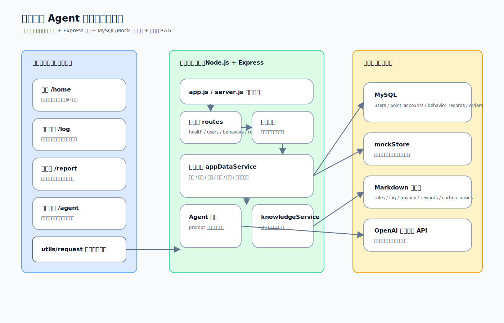

图表说明：系统由微信小程序前端、Express 接口服务、业务服务层、MySQL/Mock 双数据源以及本地知识库与模型服务共同组成，形成一个适合校园低碳场景的轻量分层架构。

### 3.2 核心业务流程图

业务场景：低碳行为打卡—积分累计—周报生成—Agent 解读  
图表类型：流程图  
图表文件：

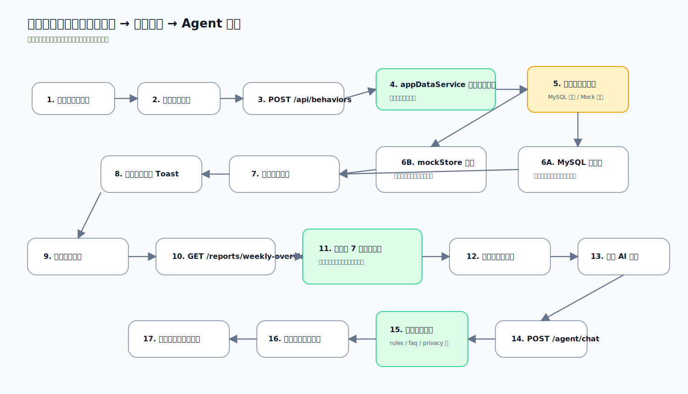

流程说明：
1. 用户从首页进入日志打卡页。
2. 用户选择具体低碳行为并提交。
3. 后端校验行为目录并根据数据源状态写入 MySQL 或回退 Mock。
4. 系统返回积分奖励与减碳结果，在前端弹出反馈提示。
5. 报告页聚合近 7 天记录，形成趋势图和周度摘要。
6. 用户可继续进入 Agent 页面，让“小碳”基于知识库和模型对周报进行解读。

## 4 架构详细说明

### 4.1 组件职责定义

| 组件名称 | 所属层级 | 核心职责 | 关键接口/方法 |
|---|---|---|---|
| `miniapp/pages/home` | 前端表现层 | 展示首页概览、积分、挑战入口和快捷导航 | `loadHomeData()`、`recordNow()`、`openVoiceAssistant()` |
| `miniapp/pages/log` | 前端表现层 | 提供行为打卡交互、调用行为提交接口、弹出奖励提示 | `loadBehaviorCatalog()`、`selectBehavior()`、`showRewardToast()` |
| `miniapp/pages/report` | 前端表现层 | 展示周报指标、趋势图、最佳减碳日与 Agent 入口 | `loadReportData()`、`buildTrendBars()`、`openAgent()` |
| `miniapp/pages/agent` | 前端表现层 | 提供对话式问答界面、建议问题和消息滚动体验 | `sendMessage()`、`tapSuggestion()` |
| `server/src/routes` | 接口层 | 负责按业务模块拆分 REST 路由 | `/users`、`/behaviors`、`/reports`、`/agent` |
| `server/src/controllers` | 接口层 | 接收请求、调用服务层、组织返回结果 | 行为、报告、商城、Agent 等控制器 |
| `appDataService.js` | 业务服务层 | 统一处理用户、积分、行为、商品、周报相关业务逻辑 | `getCurrentUser()`、`submitBehavior()`、`getWeeklyOverview()`、`redeemProduct()` |
| `agentService.js` | 智能服务层 | 负责构造模型消息、调用模型接口、返回建议追问 | `chat()`、`buildMessages()`、`buildSuggestions()` |
| `knowledgeService.js` | 知识检索层 | 从 Markdown 知识库中切块并检索相关片段 | `retrieveRelevantChunks()`、`formatChunksForPrompt()` |
| `mockStore.js` | 数据回退层 | 在数据库不可用时提供演示数据与交互结果 | `submitBehavior()`、`redeemProduct()` 等 |
| MySQL 数据库 | 数据层 | 持久化用户、积分、行为记录、订单、商品等结构化数据 | `users`、`point_accounts`、`behavior_records`、`orders` |
| Markdown 知识库 | 知识数据层 | 存放积分规则、FAQ、隐私政策和低碳常识内容 | `knowledge/*.md` |

### 4.2 组件交互关系

**交互场景 1：低碳行为打卡**
- 调用链：`日志打卡页` → `utils/request` → `POST /api/behaviors` → `behaviorController` → `appDataService.submitBehavior()` → `MySQL / mockStore`
- 协议：RESTful
- 数据格式：JSON
- 说明：前端提交行为编码与名称，服务层匹配行为目录，完成积分计算、用户总积分与总减碳量更新，并返回奖励结果。

**交互场景 2：周报查看**
- 调用链：`报告页` → `GET /api/reports/weekly-overview` → `reportController` → `appDataService.getWeeklyOverview()` → `MySQL / mockStore`
- 协议：RESTful
- 数据格式：JSON
- 说明：服务层聚合近 7 天行为记录，返回周标签、总减碳量、总积分、行为次数和趋势数组，由前端生成趋势柱状图。

**交互场景 3：Agent 问答**
- 调用链：`Agent 页` → `POST /api/agent/chat` → `agentController` → `agentService.chat()` → `knowledgeService.retrieveRelevantChunks()` → `OpenAI 兼容 API`
- 协议：RESTful
- 数据格式：JSON
- 说明：服务层先在本地知识库中检索相关片段，再组织成系统提示词和用户消息发送给模型，最后返回答案、建议问题与引用来源。

### 4.3 关键数据流说明
1. **行为记录数据流**：前端提交行为码 → 服务层计算积分与减碳值 → 更新用户总积分/总减碳量 → 记录积分日志 → 返回前端提示。
2. **周报数据流**：后端从近 7 天行为记录中按日期统计 → 汇总趋势数组与总量 → 前端绘制数据卡片和柱状图。
3. **知识问答数据流**：用户输入问题 → 本地知识库切块检索 → 将相关片段拼接进 prompt → 模型生成回答 → 前端展示结果与追问建议。

### 4.4 技术考量
- **双数据源策略**：`appDataService` 内通过 `isDbAvailable()` 判断当前数据源状态，在数据库不可用时自动回退 Mock，这一策略兼顾了开发演示稳定性与真实落库扩展性。
- **前后端解耦**：小程序页面只负责表现与交互，统一通过 `request.ts` 调用后端接口，便于后续替换服务地址或扩展鉴权逻辑。
- **Agent 模块可演进性**：当前使用本地 Markdown + 关键词检索，虽不如向量搜索强大，但足够支撑课程实验展示；后续可升级为向量数据库和重排序方案。
- **可维护性**：按路由、控制器、服务、数据访问拆分文件，便于定位问题和模块扩展。

## 5 UI 视觉设计

### 5.1 设计范围界定

本次 UI 设计聚焦项目最具业务代表性的页面，不包含“登录/注册/通用设置页”等老师说明可豁免的通用页面。

| 页面名称 | 页面类型 | 设计重点 | 优先级 |
|---|---|---|---|
| 首页 | 看板/入口页 | 数据概览、功能导航、AI引导、视觉品牌统一 | 高 |
| 日志打卡页 | 行为操作页 | 快速记录、即时反馈、低认知负担交互 | 高 |
| 碳报告页 | 数据分析页 | 指标卡片、趋势展示、报告解读入口 | 高 |
| 小碳问答页 | 对话页 | 消息层级、建议问题、输入区可用性 | 高 |

### 5.2 核心页面设计

#### 5.2.1 页面一：首页

页面定位：作为系统主入口，向用户展示当前积分、减碳成果、校园挑战、近期成就和快速导航，并通过 AI 入口引导用户进行后续记录与问答。

线框图：

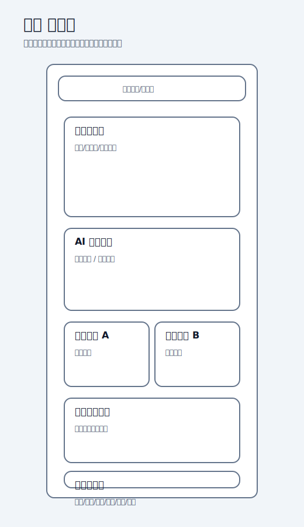

高保真设计稿：

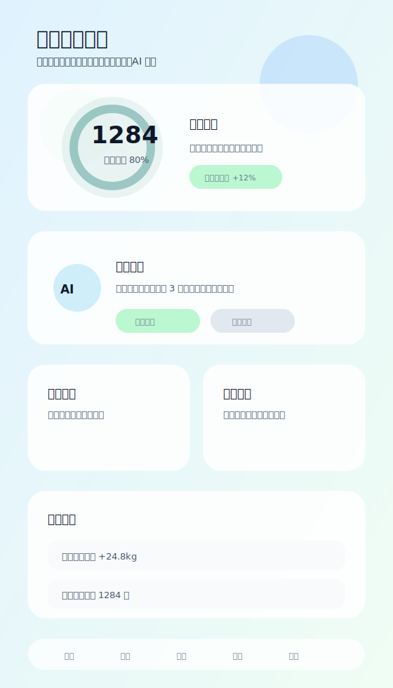

页面元素说明：

| 元素名称 | 元素类型 | 位置 | 交互说明 | 备注 |
|---|---|---|---|---|
| 品牌栏 | 顶部栏 | 顶部 | 展示品牌与通知入口 | 强化应用识别 |
| 积分环形区 | 数据卡片 | 首屏中心 | 展示积分与完成度，吸引用户关注核心目标 | 首页视觉中心 |
| AI 建议卡 | 对话卡片 | 首屏下方 | 点击“马上记录”跳转日志页 | 强化 Agent 引导 |
| 快捷功能区 | 导航卡片 | 中部 | 点击跳转不同业务模块 | 缩短任务路径 |
| 近期成就区 | 内容列表 | 中下部 | 浏览近期成果与累计收益 | 提升成就感 |
| 底部导航 | 导航栏 | 底部 | 在首页、日志、广场、商城、报告、我的之间切换 | 全局导航 |

交互逻辑：
1. 进入页面：自动并行请求用户信息、积分账户与周报概览。
2. 点击“马上记录”：跳转到日志打卡页。
3. 点击快捷卡片：进入对应业务页面。
4. 下拉刷新：重新请求首页数据并更新概览。
5. 异常状态：当接口失败时通过 Toast 提示“首页数据加载失败”。

#### 5.2.2 页面二：日志打卡页

页面定位：系统核心业务页面，用户通过选择低碳行为类型完成打卡，系统即时反馈积分和减碳值。

线框图：

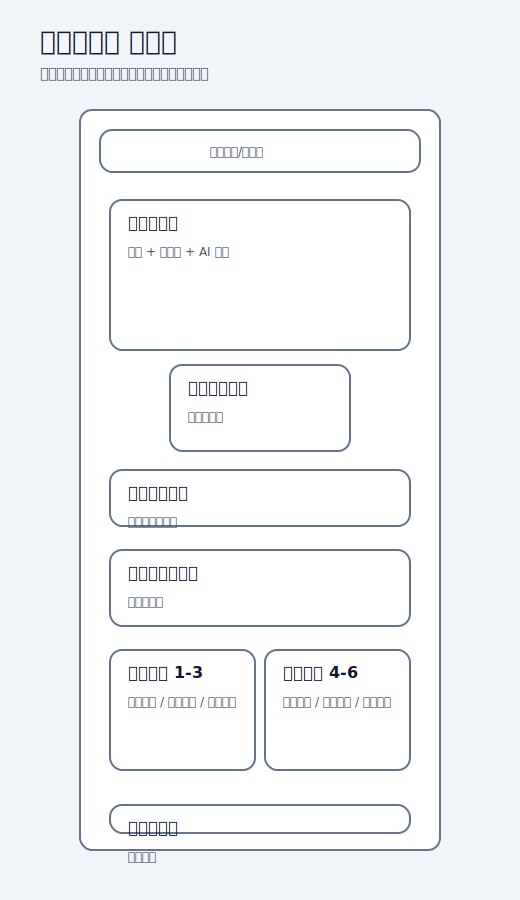

高保真设计稿：

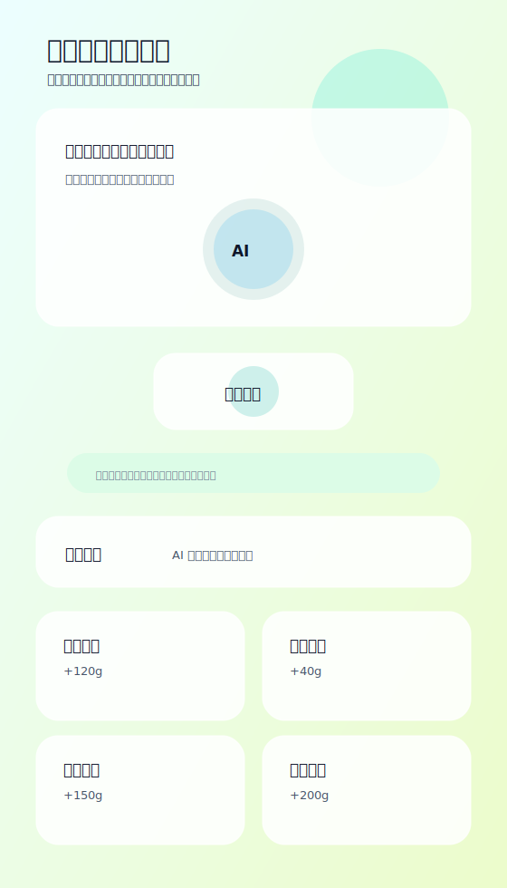

页面元素说明：

| 元素名称 | 元素类型 | 位置 | 交互说明 | 备注 |
|---|---|---|---|---|
| 页面标题区 | 说明区 | 顶部 | 提示页面目标与示例输入 | 降低理解门槛 |
| AI 圆球 | 视觉装饰/入口 | 中部上方 | 强化智能助手存在感 | 品牌化视觉 |
| 语音按钮 | 主操作按钮 | 中部 | 当前点击显示“下一步接入”提示 | 为后续扩展预留 |
| 快捷记录卡片 | 卡片按钮 | 中下部 | 点击后调用行为提交接口 | 关键操作区 |
| 奖励 Toast | 浮层反馈 | 顶部浮层 | 成功后显示积分与减碳奖励 | 强化即时反馈 |
| 底部导航 | 导航栏 | 底部 | 页面切换 | 全局一致性 |

交互逻辑：
1. 进入页面：请求行为目录，映射行为名称与减碳值。
2. 点击行为卡片：发送 `POST /api/behaviors` 请求。
3. 提交成功：弹出奖励 Toast，展示获得积分与减碳量。
4. 点击“小碳问答”：跳转到 Agent 页咨询规则问题。
5. 异常状态：提交失败时提示“提交失败，请稍后再试”。

#### 5.2.3 页面三：碳报告页

页面定位：数据反馈页面，用于向用户展示近 7 天的减碳表现、积分增长与行为次数，并引导进一步解读报告。

线框图：

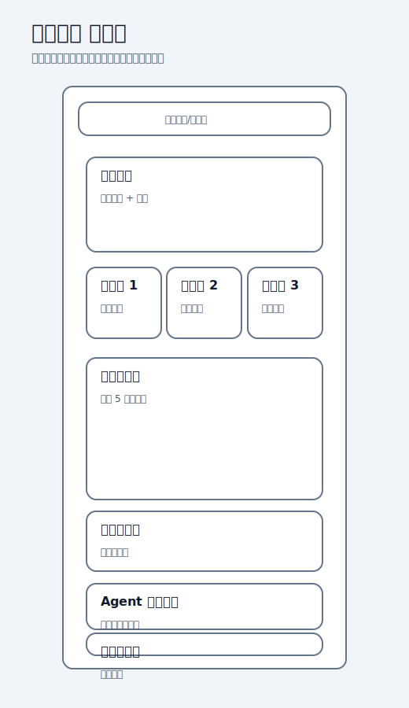

高保真设计稿：

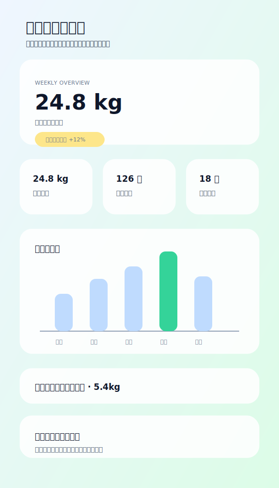

页面元素说明：

| 元素名称 | 元素类型 | 位置 | 交互说明 | 备注 |
|---|---|---|---|---|
| 周报主卡 | 核心数据卡 | 顶部 | 展示本周总减碳量与变化趋势 | 报告主视觉 |
| 指标卡片组 | 数据卡片 | 中部 | 展示本周减碳、积分、行为次数 | 结构化呈现 |
| 趋势柱状图 | 图表区 | 中下部 | 展示最近 5 天减碳趋势 | 数据分析核心 |
| 亮点卡片 | 提示卡片 | 中下部 | 展示最佳减碳日 | 提升解读性 |
| Agent 解读卡 | 跳转卡片 | 下部 | 点击进入问答页 | 数据分析延展 |
| 行动按钮 | 按钮组 | 底部前 | 海报分享 / 报告解读 | 二次传播与持续使用 |

交互逻辑：
1. 进入页面：请求周报接口，构建指标、趋势柱和亮点信息。
2. 下拉刷新：重新请求最新周报数据。
3. 点击“让小碳解读报告”：跳转到 Agent 页。
4. 点击“生成分享海报”：当前提示“下一步接入”，保留扩展空间。
5. 异常状态：接口失败时提示“报告数据加载失败”。

#### 5.2.4 页面四：小碳问答页

页面定位：项目特色页面，提供与业务规则、低碳知识、商城兑换、隐私合规等相关的对话式问答体验。

线框图：

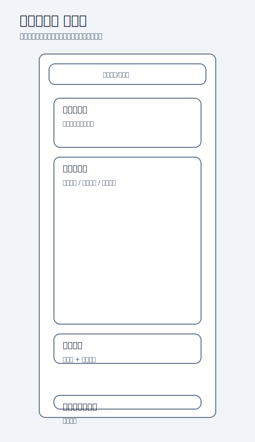

高保真设计稿：

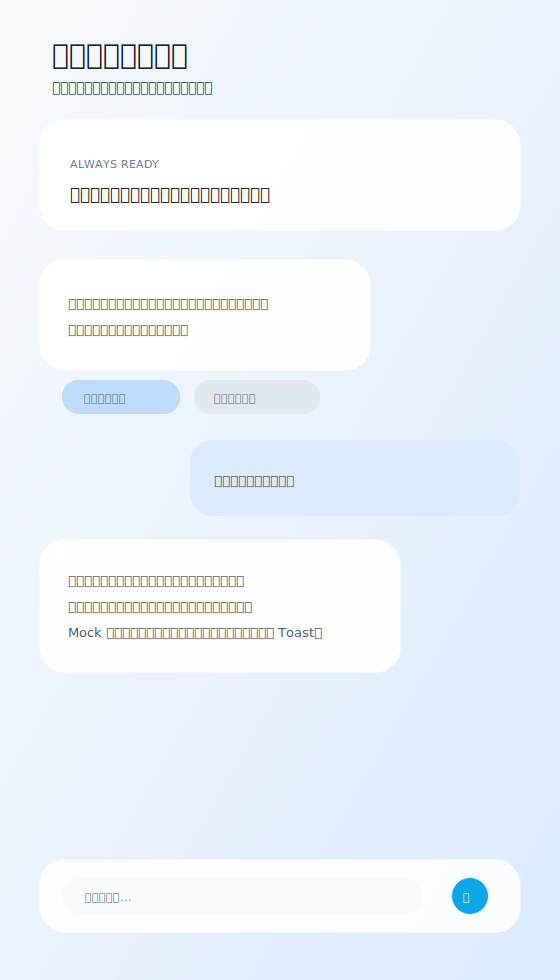

页面元素说明：

| 元素名称 | 元素类型 | 位置 | 交互说明 | 备注 |
|---|---|---|---|---|
| 返回按钮 | 图标按钮 | 顶部左侧 | 返回上一页；失败时回到首页 | 保证路径可逆 |
| 欢迎提示卡 | 信息卡片 | 顶部 | 说明问答能力范围 | 新手引导 |
| 消息列表 | 对话容器 | 中部 | 展示用户消息与助手消息 | 核心内容区 |
| 建议问题芯片 | 辅助按钮 | 助手消息下方 | 点击后自动发送问题 | 降低提问成本 |
| 输入框 | 表单输入 | 底部 | 输入文本后发送 | 单轮交互主入口 |
| 发送按钮 | 按钮 | 底部右侧 | 触发提问请求 | 交互闭环 |

交互逻辑：
1. 进入页面：展示欢迎语和推荐问题。
2. 点击推荐问题：自动发起一次问答请求。
3. 输入并发送：调用 `POST /api/agent/chat`，先插入等待消息，再替换为真实回答。
4. 响应成功：展示答案与新的建议追问。
5. 异常状态：返回友好兜底回答，并给出重新提问建议。

### 5.3 交互流程设计

#### 5.3.1 核心用户流程图

流程名称：从首页进入日志打卡，再查看周报并使用 Agent 解读  
图表文件：

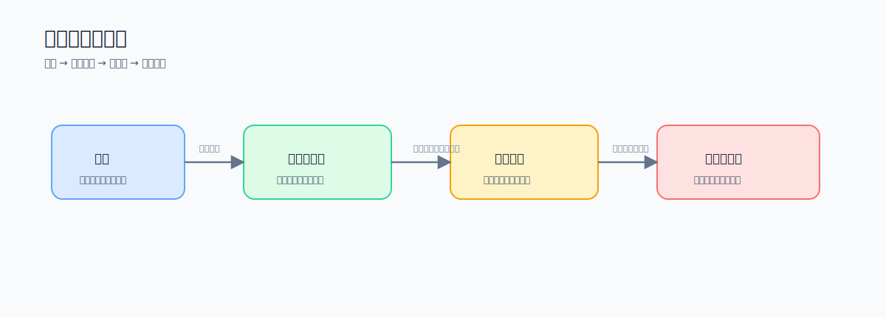

流程说明：
1. 用户先在首页查看当前数据和 AI 提示。
2. 用户通过“马上记录”或快捷入口进入日志打卡页。
3. 完成行为提交后，系统通过奖励 Toast 给予即时反馈。
4. 用户进入碳报告页查看累计结果和趋势变化。
5. 用户点击“让小碳解读报告”进入 Agent 页进行深入了解与追问。

#### 5.3.2 关键交互说明

**交互 1：行为打卡即时反馈**
- 触发方式：点击任意行为卡片。
- 交互反馈：提交成功后顶部弹出奖励 Toast，展示积分与减碳数值。
- 状态变化：页面从“可提交”切换为“提交中”，完成后恢复可交互状态。
- 异常处理：当接口失败时弹出 Toast 提示，不中断页面浏览。

**交互 2：周报趋势解读**
- 触发方式：进入报告页或下拉刷新。
- 交互反馈：更新指标卡片、趋势柱状图与最佳减碳日。
- 状态变化：页面根据后端数据重绘统计结果。
- 异常处理：接口失败时保留当前页面结构，仅提示加载失败。

**交互 3：Agent 智能追问**
- 触发方式：点击建议问题芯片或手动输入后点击发送。
- 交互反馈：先显示“整理回答中”的等待态，再展示正式答案和新的建议问题。
- 状态变化：输入框清空、发送按钮进入禁用态，直到接口返回。
- 异常处理：使用兜底回复和替代建议问题，避免页面出现空白状态。

## 6 UI 设计文件清单

### 6.1 线框图
- 首页：`assets/ui-wireframes/home-wireframe.svg`
- 日志打卡页：`assets/ui-wireframes/log-wireframe.svg`
- 碳报告页：`assets/ui-wireframes/report-wireframe.svg`
- 小碳问答页：`assets/ui-wireframes/agent-wireframe.svg`

### 6.2 高保真设计稿
- 首页：`assets/ui-mockups/home-mockup.svg`
- 日志打卡页：`assets/ui-mockups/log-mockup.svg`
- 碳报告页：`assets/ui-mockups/report-mockup.svg`
- 小碳问答页：`assets/ui-mockups/agent-mockup.svg`

### 6.3 图表与流程图
- 系统整体架构图：`assets/architecture/system-architecture.svg`
- 核心业务流程图：`assets/architecture/core-business-flow.svg`
- 核心用户流程图：`assets/ui-flows/core-user-flow.svg`

## 7 实验结论

本次实验围绕“碳迹同行 Agent”项目完成了系统架构设计与核心功能 UI 设计。架构上，项目采用适合课程实验与校园应用初期的分层架构，通过小程序前端、Express 后端、MySQL/Mock 双数据源与 Agent/RAG 能力构建出一个可运行、可演示、可扩展的低碳生活服务系统。UI 设计上，围绕首页、日志打卡、碳报告和小碳问答四个关键页面完成了从线框图到高保真稿的设计，重点突出“低认知负担、即时反馈、品牌一致性和智能引导”四项原则。整体设计既符合当前项目实现状态，也为后续完善真实登录、真实落库、商城闭环和向量检索升级提供了清晰蓝图。

## 8 提交前检查清单

### 8.1 架构设计部分
- [x] 包含系统架构拓扑图
- [x] 包含至少一个核心流程图
- [x] 架构描述文档完整（含决策理由、组件说明、交互流程）
- [x] 图表清晰可读，并提供对应说明

### 8.2 UI 设计部分
- [x] 包含至少 3 个核心页面的线框图
- [x] 包含至少 3 个核心页面的高保真设计稿
- [x] 包含关键交互逻辑说明
- [x] 包含核心用户流程图

### 8.3 导出说明
- [ ] 将首页信息中的专业班级、姓名、日期补充完整
- [ ] 在支持 Markdown 导出的工具中导出为 PDF
- [ ] 按老师要求命名为 `SE_Exp04项目名称组长姓名.pdf`
